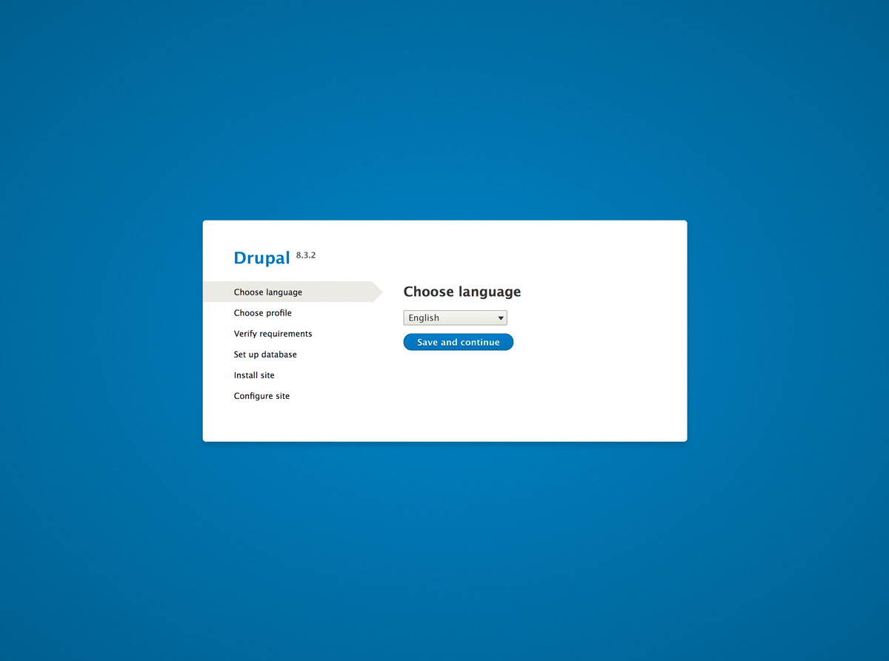
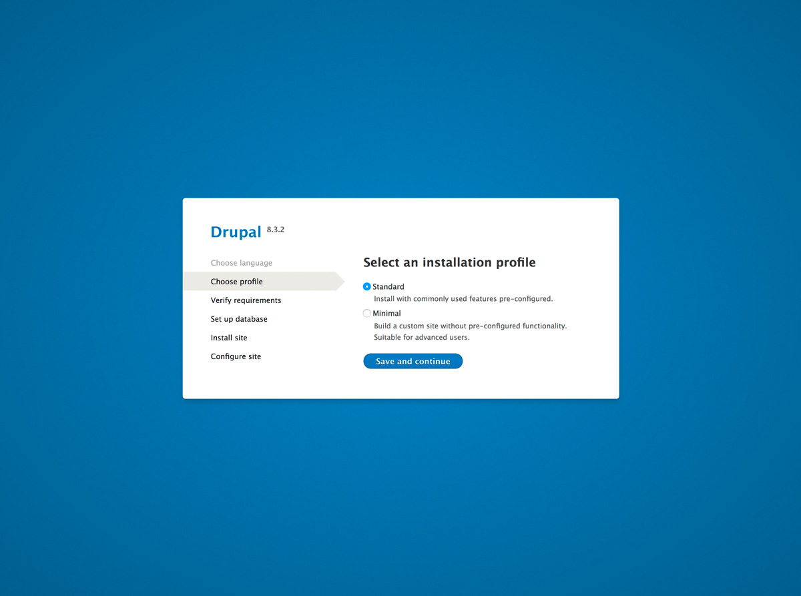
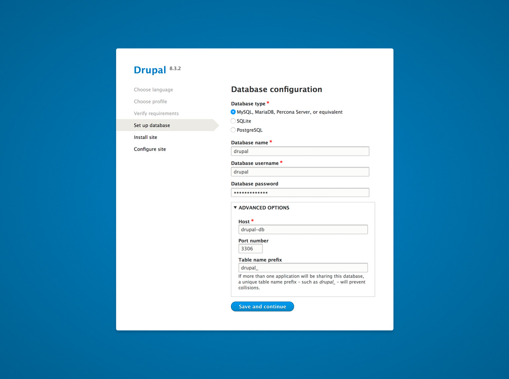
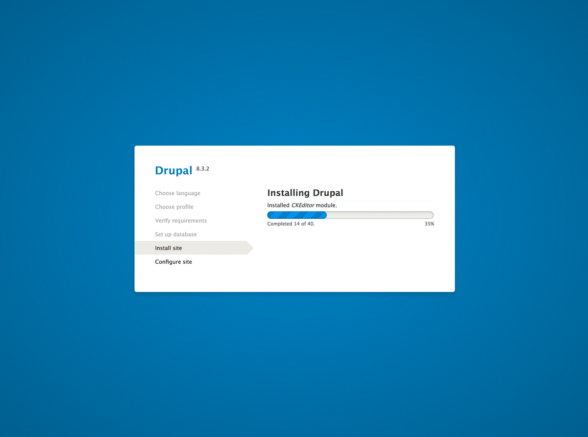
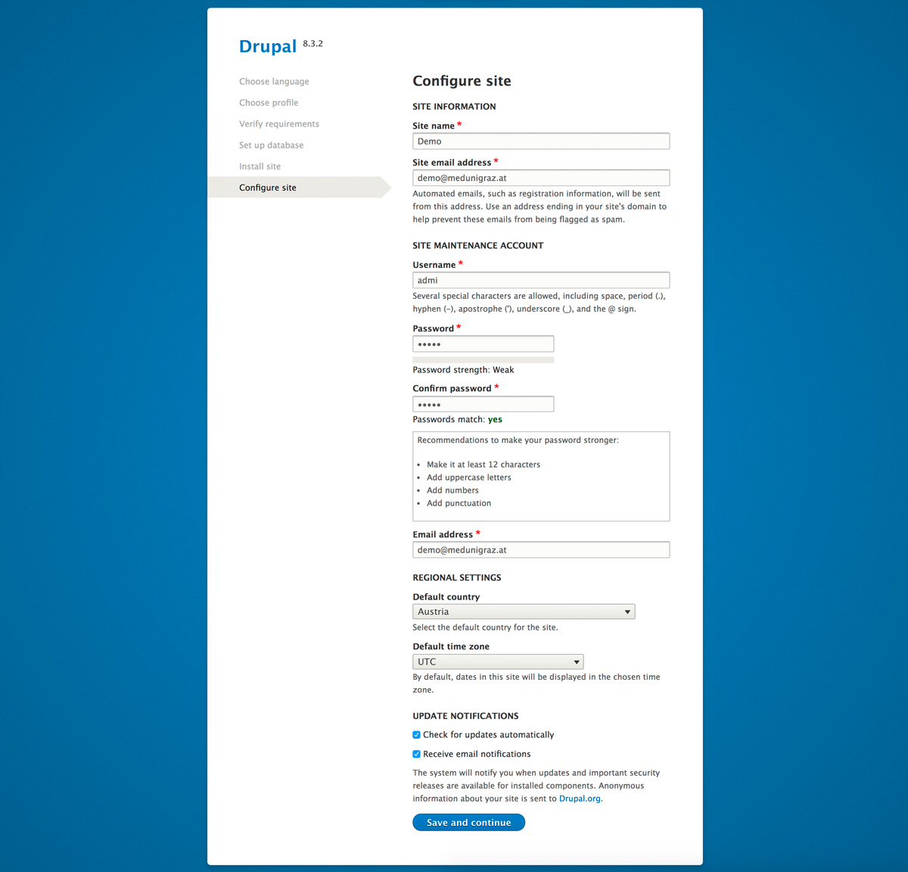
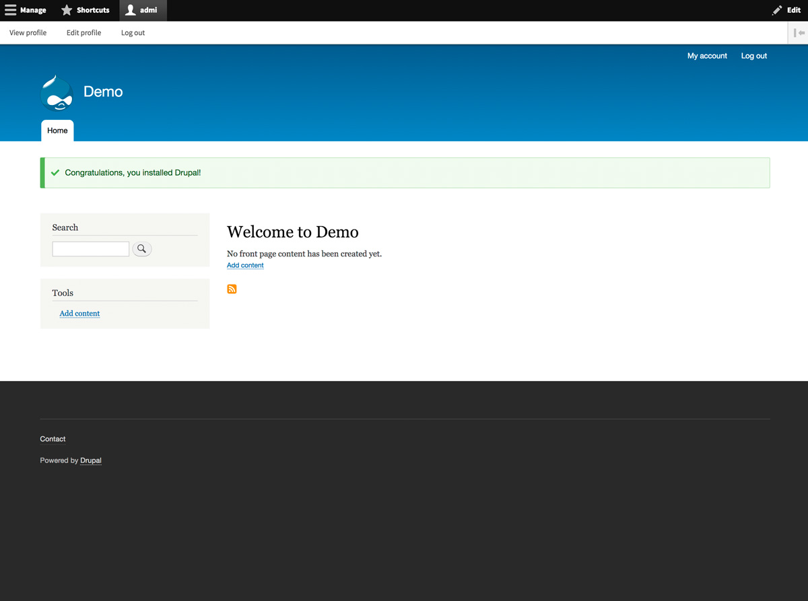

## Quick Notes

Database information is as follows:

```
Database user:      drupal
Database password:  drupal4bibbox
Database name:      drupal
Database host:      drupal-db
```


## Drupal Installation Instructions 

- As soon as Drupal has been installed within the BIBBOX, you can launch it from the Applications menu.

- A new Tab will open in your browser and show you Drupal's setup page. In this first step, simply select your prefered language and click **Save and continue**.

    
    
- Next, choose the **Standard** installation and again click **Save and continue**.

    
    
- In the third step, you will need to enter the database information as shown in the screenshot.

        Database user:      drupal
        Database password:  drupal4bibbox
        Database name:      drupal
        Database host:      drupal-db

    
    
- Drupal will now install and might take a bit of time.

    
    
- Next, you will be asked to enter some general information for your Drupal website. Here you can choose a **Site name**, administrator information, **Default country**, **Default time zone** and notification settings. If everything is filled out, click on **Save and continue**.

    
    
- Congratulations, your Drupal website is now set up and ready to be personalized!

    


## After the installation

Have a nice ride with the new Admins youngtimer.


